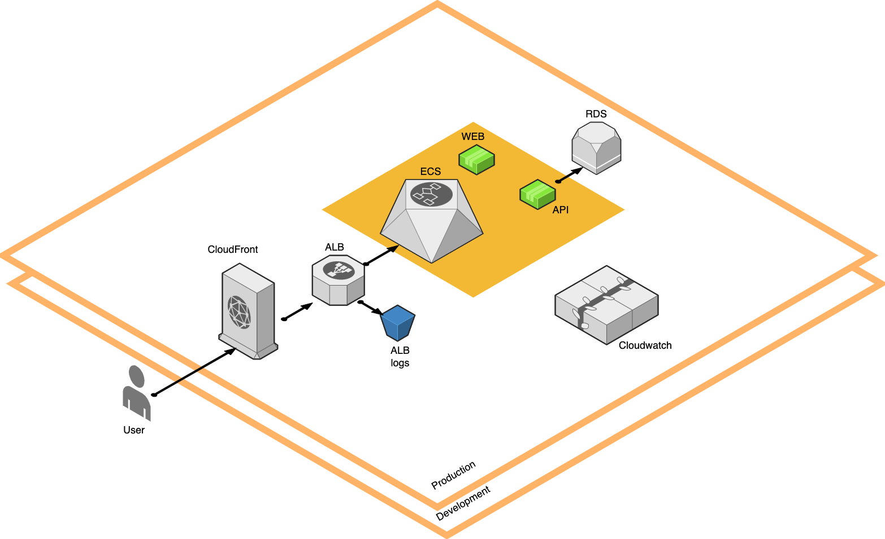
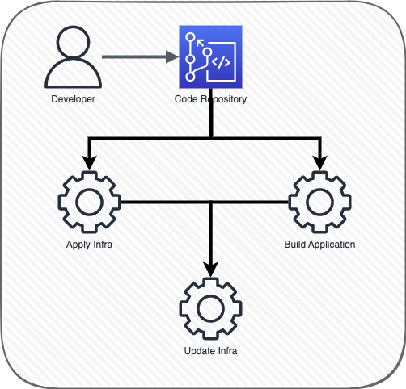
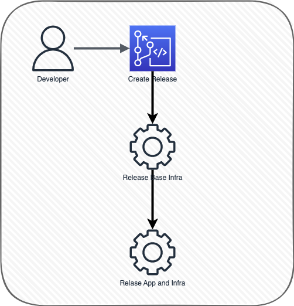

**Task:** Continuous Delivery 3 - Tier

Estimated time/effort: 10-20 hours

Expected delivery time: 7 days

**Task scope and expectations**

- The purpose of this task is to build a functional real-life application with all listed
  requirements.
- What we want to see is how you will implement some real-life functionalities by paying
  attention to details and following good development practices.
- We want to see you understand how to set up a proper project infrastructure, show
  knowledge of simple problem solving, and knowledge of using your preferred
  frameworks and libraries.
- Instead of spending a lot of time on providing a custom UI, please rather ensure the
  functionality is properly done.

**Task details**

You want to design a continuous delivery architecture for a scalable and secure 3-tier Node application.

Application to use can be found on https://git.toptal.com/henrique/node-3tier-app2

Both web and API tiers should be exposed to the internet and the DB tier should not be
accessible from the internet.

You should clone the repository and use it as the base for your system.

- You need to create resources for all the tiers.
- The architecture should be completely provisioned via some infrastructure as a code
  tool.
- The presented solution must handle server (instance) failures.
- Components must be updated without downtime in service.
- The deployment of new code should be completely automated (bonus points if you
  create tests and include them in the pipeline).
- The database and any mutable storage need to be backed up at least daily.
- All relevant logs for all tiers need to be easily accessible (having them on the hosts is
  not an option).
- You should fork the repository and use it as the base for your system.
- You should be able to deploy it on one larger Cloud provider: AWS/Google
  Cloud/Azure/DigitalOcean/RackSpace.
- The system should present relevant historical metrics to spot and debug bottlenecks.
- The system should implement CDN to allow content distribution based on client
  location

As a solution, please commit to the Toptal git repo the following:

- An architectural diagram / PPT to explain your architecture during the interview.
- All the relevant configuration scripts (Terraform/Ansible/Cloud Formation/ARM
  Templates)
- All the relevant runtime handling scripts (start/stop/scale nodes).
- All the relevant backup scripts.
- You can use another git provider to leverage hooks, CI/CD, or other features not
  enabled in Toptal's git. Everything else, including the code for the CI/CD pipeline, must
  be pushed to Toptal's git.

**The complete solution must be deployed and working before the interview.**

**Milestones and task delivery**

- The deadline to submit your completed project is 1 week from the moment you
  received the project requirements.
- It means the project code must be submitted within 1 week from the moment that was
  delivered to you by email.
- If you schedule your final interview after the 1-week deadline, make sure to submit
  your completed project and all code to the private repository before the deadline.
- Everything that is submitted after the deadline will not be taken into consideration.
- Please do not commit any code at least 6 hours before the meeting time so that it can
  be reviewed. Anything that is submitted after this time will not be taken into
  consideration.
- Please join the meeting room for this final interview on time. If you miss your interview
  without providing any prior notice, your application may be paused for six months.

## Solution Architecture

## Workflows

### Application update

### Release version

..
